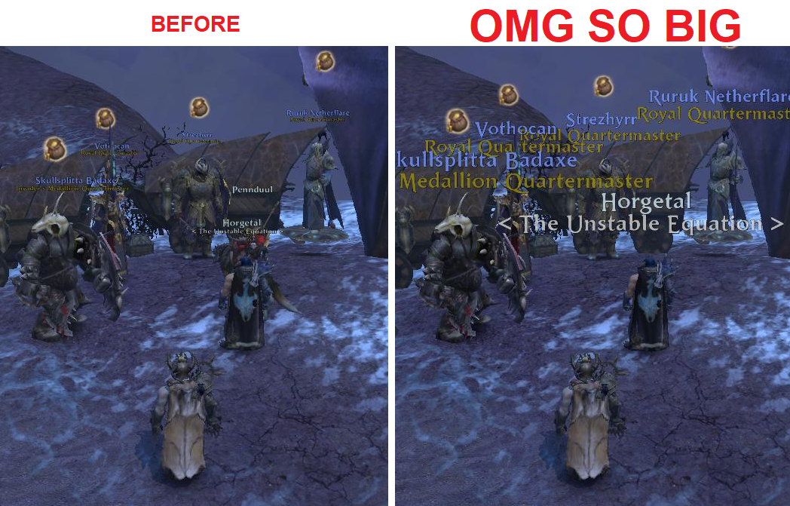
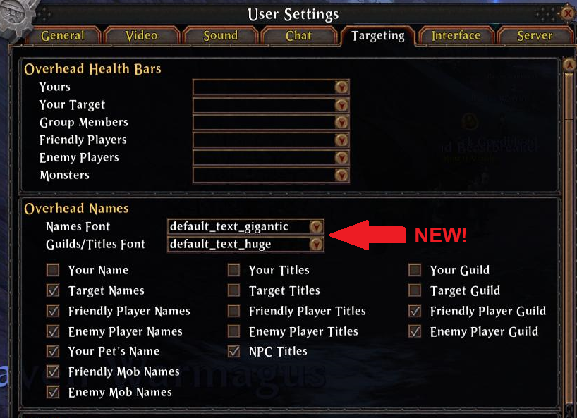

# OverheadFonts

*With apologies to warband leaders and other named priority targets...*

This add-on allows you to change the font used to display the name and the guild/title that appear over the heads of players and NPCs in the game world. Usually the game only lets you pick from two options: "Simple" and "Stylized", but WAR's add-on API actually allows for any font to be used.

To change the fonts, go to "User Settings" and then "Targeting" as before. This add-on has replaced the single drop-down box for "Simple" and "Stylized" with two drop-down boxes: one to pick a font for names, and one for guilds/titles. Please note that these are the only two options provided by the WAR add-on API. For example, it is impossible to have the guild font different from the title font.

The font list is all of the font types the game comes with. It is impossible to define additional ones, so this list is all you get. The biggest ones appear to be the ones that end in "gigantic".

If this add-on is deemed problematic by any of the WAR private servers and they wish to block it, then all they need to do is hook the `SetNamesAndTitlesFont (string, string)` API function and restrict the first parameter to either `"font_name_plate_names"` or `"font_name_plate_names_old"`, and the second parameter to either `"font_name_plate_titles"` or `"font_name_plate_titles_old"`.