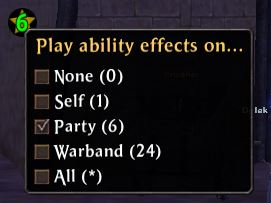

# PlayEffectsOn

This add-on creates a small circular button-like window. The window can be moved by dragging it with the left mouse button. Right clicking on the window brings up a context menu that lets you change the current "Play ability effects on" setting without needing to work your way through the main menu.

The add-on respects which custom performance option you are using. If you are not using a custom performance option then the add-on won't do anything as you can only manually change the "Play ability effects on" setting with a custom performance option.

The menu uses the same text translations as the client so it should work in all languages, assuming the client has a translation for those options.